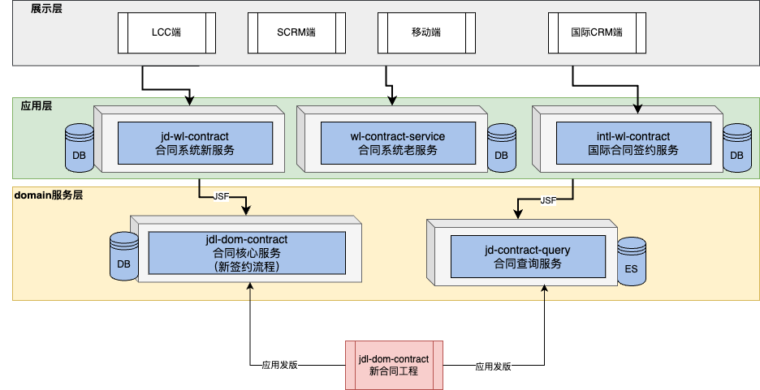

# HSBC-TEST项目说明

本项目为试验工程。本工程以Springboot2.7 + JDK17为基础开发。


## 工程结构
```yaml
--root
    --application: 应用层是程序的入口
        --controller: springMVC提供的controller
        --listener: MQ消息监听器
        --translate: 将内部的BO映射为外部的VO/Entity
        --model: VO对象
    --domain: 领域层
       --account: 用户账号子域
          --entity: 账号实体
          --service: service服务
          --facade: 针对infrastructure层的接口定义, 实现控制反转
       --transaction: 交易信息子域
          --entity: 交易信息实体
          --command: 定义交易指令command对象
          --event: 定义交易事件
          --service: service服务
          --facade: 针对infrastructure层的接口定义, 实现控制反转
       --common: 公共包
          --aop: 切面实现
          --cache: 缓存定义, 控制反转,实现在infrastracture层
          --exception: 异常定义
          --util: 常用工具类
    --infrastructure: (依赖domain层)
       --repository: 持久化层，包括db模型，sql读写等
       --cache: Redis缓存读写
       --producer: MQ消息生成，即发送MQ消息。
       --config: 配置信息，例如ducc配置、数据库、缓存配置等
       --mq: 消息实现
```

## 架构层级说明
### Application层
应用层是DDD中的顶层，负责协调和组织领域对象的交互。它接收来自用户界面或外部系统的请求，并将其转发给领域层进行处理。应用层负责定义应用的用例（Use Cases），处理事务边界和协调领域对象的操作。它不包含业务逻辑，而是将请求转化为领域对象的操作。应用层还可以包含获取输入，组装上下文，参数校验，异常定义，发送事件通知等。<br>
### Domain层
主要是封装了核心业务逻辑，并通过领域服务（Domain Service）和领域对象（Domain Entity）的方法对App层提供业务实体和业务逻辑计算。领域是应用的核心，不依赖任何其他层次。同时领域层会有一个facade层，当领域服务对外部有调用依赖时，通过定义facade接口实现控制反转。<br>
### 基础设施层(Infrastructure)
负责提供支持应用程序运行的基础设施，包括与具体技术相关的实现。基础设施层通常包括与数据库、消息队列、缓存、外部服务等进行交互的代码，以及一些通用的工具类和配置，也包括filter等实现。<br>
### 依赖关系



## 系统详细设计
本业务场景涉及内容包括核心域account和transaction，其中account是用户账号子域，transaction是交易信息子域。同时还采用了消息队列和缓存的方式增加并发能力,具体设计方案请点击下面文档:
### [系统详细设计说明文档.md](./document/archetct-design.md)

## 部署说明
本工程部署在阿里云的ACK中,中间件用的是阿里云的云RDS和云kafka, redis因为只是缓存需要, 自建在k8s之中,通过容器化部署.具体部署说明请点击下面文档:

### [部署说明文档.md](./document/deploy.md)

## 测试说明
本工程涉及的测试包括:
- #### 1. 开发阶段的单元测试和集成测试.
- #### 2. 压力性能测试.
- #### 3. k8s部署环节的弹性测试

具体测试说明文档请点击下面文档:

### [测试说明文档.md](./document/test.md)


