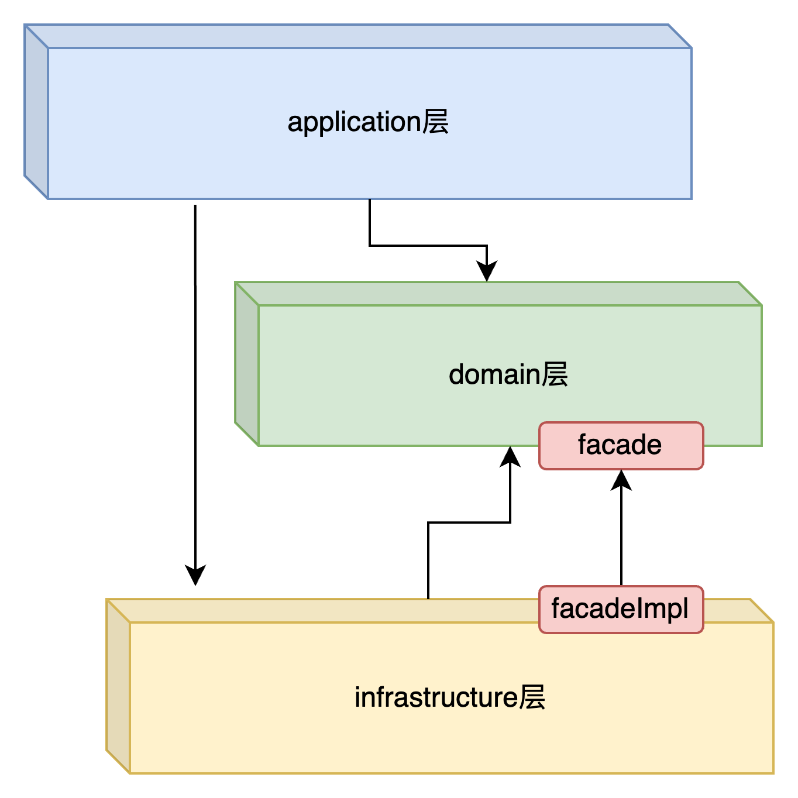

# HSBC-TES项目说明

本项目为试验工程。本工程以Springboot2.7 + JDK17为基础开发。


## 工程结构
```yaml
--root
    --application: 应用层是程序的入口
        --controller: springMVC提供的controller
        --listener: MQ消息监听器
        --translate: 将内部的BO映射为外部的VO/Entity
        --model: VO对象
    --domain: 领域层
       --account: 用户账号子域
          --entity: 账号实体
          --service: service服务
          --facade: 针对infrastructure层的接口定义, 实现控制反转
       --transaction: 交易信息子域
          --entity: 交易信息实体
          --command: 定义交易指令command对象
          --event: 定义交易事件
          --service: service服务
          --facade: 针对infrastructure层的接口定义, 实现控制反转
       --common: 公共包
          --aop: 切面实现
          --cache: 缓存定义, 控制反转,实现在infrastracture层
          --exception: 异常定义
          --util: 常用工具类
    --infrastructure: (依赖domain层)
       --repository: 持久化层，包括db模型，sql读写等
       --cache: Redis缓存读写
       --producer: MQ消息生成，即发送MQ消息。
       --config: 配置信息，例如ducc配置、数据库、缓存配置等
       --mq: 消息实现
```

## 架构层级说明
### Application层
应用层是DDD中的顶层，负责协调和组织领域对象的交互。它接收来自用户界面或外部系统的请求，并将其转发给领域层进行处理。应用层负责定义应用的用例（Use Cases），处理事务边界和协调领域对象的操作。它不包含业务逻辑，而是将请求转化为领域对象的操作。应用层还可以包含获取输入，组装上下文，参数校验，异常定义，发送事件通知等。<br>
### Domain层
主要是封装了核心业务逻辑，并通过领域服务（Domain Service）和领域对象（Domain Entity）的方法对App层提供业务实体和业务逻辑计算。领域是应用的核心，不依赖任何其他层次。同时领域层会有一个facade层，当领域服务对外部有调用依赖时，通过定义facade接口实现控制反转。<br>
### 基础设施层(Infrastructure)
负责提供支持应用程序运行的基础设施，包括与具体技术相关的实现。基础设施层通常包括与数据库、消息队列、缓存、外部服务等进行交互的代码，以及一些通用的工具类和配置，也包括filter等实现。<br>
### 依赖关系



## 系统详细设计
本业务场景涉及内容包括核心域account和transaction，其中account是用户账号子域，transaction是交易信息子域。同时还采用了消息队列和缓存的方式增加并发能力,具体设计方案请点击下面链接:
### [系统详细设计说明.md](./document/archetct-design.md)

## 部署说明
本工程部署在阿里云的ACK中,中间件用的是阿里云的云RDS和云kafka, redis因为只是缓存需要, 自建在k8s之中,通过容器化部署.具体部署说明期刊如下文档:

### [部署说明.md](./document/deploy.md)

## 测试说明
### 1. 单元测试和集成测试.
在代码工程中,所有核心接口及核心业务逻辑都进行了单元测试和集成测试.
其中domain层中, 最核心的AccountService和TransactionService都进行了单元测试, 测试覆盖率达到了80%以上.
infrastructure层中, facade实现类, redisson实现类,MQ消息发送都进行了单元测试, 测试覆盖率达到了80%以上.
application层, TransactionController对外的服务接口,实现了集成测试.

### 2. 压力性能测试
本工程采用jmeter对核心服务进行压力测试.其中为了更方便的进行压力测试,进行了如下前期准备工作:
1. 引入的faker组件, 用于生成模拟测试数据.前期,通过faker生成50个用户账号信息,然后通过faker模拟随机交易信息.
2. 封装了一个压力测试接口, /pressure/test/transaction,  该接口可以做到随机选择50个用户账号信息中的两个, 进行模拟交易.
#### 压测场景说明
1. 实例资源为k8s中部署两个应用实例, 每个应用实例的资源限制为1C2G.
2. k8s集群公网IP申请的网络带宽为1Mbps.
3. 压测设置: 模拟1000个用户并发, 升压时间设为1s,模拟瞬间大流量的场景, 持续发送50轮次.
#### 压测结果
压测结果详情可以查看document/jmeter文件夹下的内容.对于压测结果做以下几点说明:
1. 本次压测共产生50000条交易记录,其中失败了179, 失败原因全部是请求超时. 
2. 结合cpu, 内存和network的监控看板得出结论:此次压测的瓶颈在网络带宽, 在请求流量高峰时刻, 部分请求因为网络带宽不足,导致连接超时.
- **[查看 JMeter 测试结果详情](./document/jmeter)**

### 3. 弹性测试
弹性测试,主要是测试k8s集群的应用服务pod的自动扩缩容能力,包括pod在遇到高流量情况下,cpu在满足一定阈值后, 自动扩容pod实例, 在流量下降后, 自动缩容pod实例.

k8s的自动扩缩容能力也包含了pod的自动重启能力, 当pod出现异常时, 会自动重启pod, 保证pod的可用性.所以我基于HPA配置,对系统进行弹性压力测试.

#### 压测场景说明
1. 因为购买的网络带宽为1Mbps, 不太能支持太大流量,为了能够保证HPA的弹性效果, 我的资源设置极端一些, 这个仅在测试环境使用, 生产环境不建议这样设置.
2. 初始状态: 设置一个应用实例, 资源限制为:cpu500m, 内存512Mi, 实例数为1.
3. HPA设置: 设置cpu的阈值为50%, 最小实例数为1, 最大实例数为10. 此处cpu设置50%,只是为了确保在当前网络带宽情况下,可以触发HPA.
4. 压测设置: 模拟1000个用户并发, 升压时间设为1s,模拟瞬间大流量的场景, 持续发送50轮次.

#### 测试结果
测试结果主要通过Prometheus监控图标可以看出. 具体监控图结果信息,可以查看document/HPA-test文件夹.
关键节点信息如下:
1. 压测开始时间是17:19:42. 在17.19:54触发扩容机制, k8s启动扩容扩容到2个pod实例.
2. 紧接着,随着CPU使用率不下降, 在之后的几个时间点:
   17:20:54,从2扩容到4个pod实例
   17:21:54, 从4扩容到8个实例
   17:22:54 从8扩容到10个实例
3. 然后流量过后, 17:27:39, 从10缩容到了3个实例.  17:28:39从3缩容到1个实例.

- **[查看 HPA 弹性测试结果详情](./document/HPA-test)**


