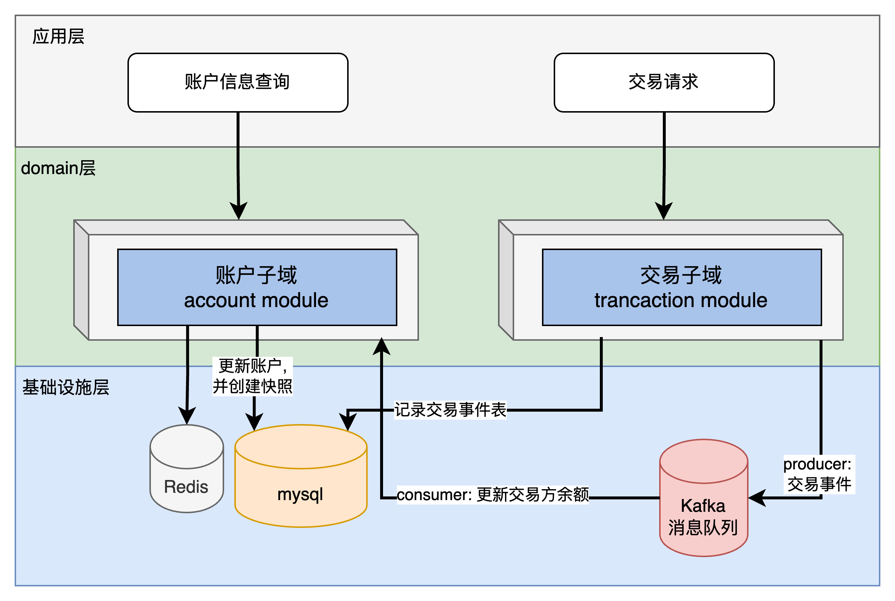

## 一、数据库设计

### 1.1 账户表（accounts）
账户表是核心主表, 主要记录客户的账号信息.

| 字段名          | 类型            | 描述     |
|--------------| --------------- |--------|
| account_id   | VARCHAR(36)     | 账户ID，主键 |
| account_name | VARCHAR(255)    | 账户名称   |
| balance      | DECIMAL(18,2)   | 当前余额   |
| created_at   | TIMESTAMP       | 创建时间   |
| updated_at   | TIMESTAMP       | 更新时间   |
| is_deleted   | TIMESTAMP       | 删除标记   |

### 1.2 交易事件表（transaction_events）
交易表是核心主表,是记录每次客户转账信息,本次采用事件溯源模式, 记录每次交易信息, 所以

| 字段名               | 类型            | 描述                |
|-------------------|---------------|-------------------|
| event_id          | VARCHAR(36)   | 事件ID，主键           |
| transaction_id    | VARCHAR(36)   | 交易ID              |
| source_account_id | VARCHAR(36)   | 源账户ID             |
| dest_account_id   | VARCHAR(36)   | 目标账户ID            |
| amount            | DECIMAL(18,2) | 交易金额              |
| event_type        | VARCHAR(50)   | 事件类型（如：交易创建）      |
| event_data        | JSON          | 事件数据              |
| status            | INT           | 状态: 0已提交,1成功,2失败  |
| failed_reason     | VARCHAR(255)  | 如果交易失败,失败原因;成功则为空 |
| created_at        | TIMESTAMP     | 事件发生时间            |
| is_deleted        | TIMESTAMP     | 删除标记              |

### 1.3 账户快照表（account_snapshots）
账户快照表的意义在于当需要通过时间回溯时, 可以基于实现数据的备份和恢复,同时可以支持时间点查询, 提升查询效率.

| 字段名        | 类型            | 描述             |
| ------------ | --------------- | ---------------- |
| snapshot_id  | VARCHAR(36)     | 快照ID，主键      |
| account_id   | VARCHAR(36)     | 账户ID           |
| balance      | DECIMAL(18,2)   | 快照时的余额      |
| version      | BIGINT          | 版本号           |
| created_at   | TIMESTAMP       | 创建时间          |
| is_deleted   | TIMESTAMP       | 删除标记   |

## 二、系统架构设计

- **采用CQRS模式**：将命令（写）和查询（读）操作分离，写操作通过事件溯源记录交易事件，读操作从账户快照或缓存中获取余额信息。
- **事件溯源**：所有的交易更新都作为事件存储在`transaction_events`表中，可以重放事件来重建账户状态。
- **中间件**：
    - **Kafka**：用于事件的发布和订阅，实现异步处理和解耦。
    - **Redis**：作为缓存层，提高读取性能，缓存账户快照信息。

  
## 三、代码维度说明

### 3.1 Maven 项目依赖（pom.xml）
本次设计持久化方案采用spring的jpa作为持久化方案.同时需要引入kafka和redis中间件.

```xml
<dependencies>
    <!-- Spring Boot Starter Web -->
    <dependency>
        <groupId>org.springframework.boot</groupId>
        <artifactId>spring-boot-starter-web</artifactId>
    </dependency>

    <!-- Spring Data JPA -->
    <dependency>
        <groupId>org.springframework.boot</groupId>
        <artifactId>spring-boot-starter-data-jpa</artifactId>
    </dependency>

    <!-- MySQL 驱动 -->
    <dependency>
        <groupId>mysql</groupId>
        <artifactId>mysql-connector-java</artifactId>
    </dependency>

    <!-- Kafka -->
    <dependency>
        <groupId>org.springframework.kafka</groupId>
        <artifactId>spring-kafka</artifactId>
    </dependency>

    <!-- Redis -->
    <dependency>
        <groupId>org.springframework.boot</groupId>
        <artifactId>spring-boot-starter-data-redis</artifactId>
    </dependency>

    <!-- Lombok -->
    <dependency>
        <groupId>org.projectlombok</groupId>
        <artifactId>lombok</artifactId>
        <optional>true</optional>
    </dependency>
</dependencies>
```

### 3.2 实体类定义

#### 3.2.1 账户实体（Account.java）

```java
@Entity
@Table(name = "accounts")
@Data
public class Account {
    @Id
    private Long id;
    
    private String accountId;

    private String accountName;

    private BigDecimal balance;

    private Timestamp createdAt;

    private Timestamp updatedAt;
    
    private Boolean isDeleted;
}
```

#### 3.2.2 交易事件实体（TransactionEvent.java）

```java
@Entity
@Table(name = "transaction_events")
@Data
public class TransactionEvent {
    @Id
    private Long id;
    
    private String eventId;

    private String transactionId;

    private String sourceAccountId;

    private String destAccountId;

    private BigDecimal amount;

    private String eventType;

    @Lob
    private String eventData;
 
    @Enumerated(EnumType.ORDINAL)
    private TransactionStatus status;
    
    private String failedReason;

    private Timestamp createdAt;

    private Boolean isDeleted;
    
}
```

#### 3.2.3 账户快照实体（AccountSnapshot.java）


```java
@Entity
@Table(name = "account_snapshots")
@Data
public class AccountSnapshot {
    @Id
    private Long id;
    
    private String snapshotId;

    private String accountId;

    private BigDecimal balance;

    private Long version;

    private Timestamp createdAt;

    private Boolean isDeleted;
}
```

### 3.3 事件总线（EventBus）接口

```java
public interface EventBus {
    void publish(TransactionEvent event);
}
```

#### 3.3.1 Kafka事件总线实现（KafkaEventBus.java）

```java
@Component
public class KafkaEventBus implements EventBus {
}
```

### 3.4 服务层实现

#### 3.4.1 交易服务接口（TransactionService.java）

```java
public interface TransactionService {
    void processTransaction(TransactionCommand command);
}
```

#### 3.4.2 交易命令（TransactionCommand.java）

```java
@Data
public class TransactionCommand {
    private String transactionId;
    private String sourceAccountId;
    private String destAccountId;
    private BigDecimal amount;
    private Timestamp timestamp;
}
```

#### 3.4.3 交易服务实现（TransactionServiceImpl.java）


### 3.5 事件处理器（EventHandler.java）

```java
@Component
public class EventHandler {

    private final AccountService accountService;

    @Autowired
    public EventHandler(AccountService accountService) {
        this.accountService = accountService;
    }

    @KafkaListener(topics = "transaction-events", groupId = "transaction-group")
    public void handleEvent(ConsumerRecord<String, String> record) {
        //todo:
    }
}
```

### 3.6 账户服务接口（AccountService.java）

账户更新方法updateAccountBalances设计最为核心,它需要满足事务性要求,且还要保证不发生死锁, 为了避免交易双方账户出现同事互相交易情况, 在更新账户逻辑时, 需要保证顺序性,可以避免死锁.

```java
public interface AccountService {
    void updateAccountBalances(TransactionCommand command);
    Account getAccountById(String accountId);
}
```
### 3.7 控制器（TransactionController.java）
主要封装两个核心接口, 一个是交易接口, 一个是账号查询接口. 同时需要保证两个接口的高并发访问能力.
```java
@RestController
@RequestMapping("/transactions")
public class TransactionController {

    private final TransactionService transactionService;
    private final AccountService accountService;

    @Autowired
    public TransactionController(TransactionService transactionService, AccountService accountService) {
        this.transactionService = transactionService;
        this.accountService = accountService;
    }

    @PostMapping("/transfer")
    public ResponseEntity<String> transfer(@RequestBody TransactionCommand command) {
        try {
           //todo:
        } catch (Exception e) {
            return ResponseEntity.status(HttpStatus.INTERNAL_SERVER_ERROR).body("交易失败：" + e.getMessage());
        }
    }

    @GetMapping("/accounts/{accountId}")
    public ResponseEntity<Account> getAccount(@PathVariable String accountId) {
        try {
           //todo:
        } catch (AccountNotFoundException e) {
            return ResponseEntity.status(HttpStatus.NOT_FOUND).body(null);
        }
    }
}
```

### 3.8 持久化层接口

#### 3.8.1 账户仓库（AccountRepository.java）
findByAccountIdForUpdate方法主要是给交易情况下,更新余额设计,此处需要增加悲观锁以防止幻读,同时需要注意,在一个事务中执行sourceAccountId和destAccountId需要保证顺序性, 否则会出现死锁.
```java
@Repository
public interface AccountRepository extends JpaRepository<Account, String> {
    @Lock(LockModeType.PESSIMISTIC_WRITE)
    @Query("select a from Account a where a.accountId = :accountId")
    Account findByAccountIdForUpdate(@Param("accountId") String accountId);
}
```

#### 3.8.2 交易事件仓库（TransactionEventRepository.java）

```java
@Repository
public interface TransactionEventRepository extends JpaRepository<TransactionEvent, String> {
}
```

### 3.9 异常处理
异常处理根据层级不同,进行不同的异常类封装:
1. infrastructure层异常处理,定义InfrastructureException类.
2. domain层的异常处理, 定义为BusinessException类.
3. 同时根据业务场景的不同,定义特定异常类InsufficientBalanceException和AccountNotFoundException.

## 四、性能优化总结

- **使用Redis缓存账户信息**，减少数据库读取压力。
- **通过Kafka进行异步事件处理**，提升系统吞吐量。
- **使用数据库索引**，优化查询性能。
- **使用数据库事务和悲观锁**，保证数据一致性。

## 五、为失败的交易实现重试机制

对于核心的交易方法,要增加重试机制, 保证在网络抖动, 数据库死锁, 数据库连接超时等情况下, 保证交易成功.
具体重试机制设计点击下面文档:
- **[为失败的交易实现重试机制](retry-design.md)**


## 六、总结

以上是一个高并发实时余额计算系统的完整实现，采用了Spring Boot框架，MVC架构，CQRS模式和事件溯源，以及Kafka和Redis等中间件。代码注重可读性和可扩展性，考虑了高可用性、可伸缩性和数据一致性。部署在Kubernetes集群上，可以满足云环境下的高并发需求。