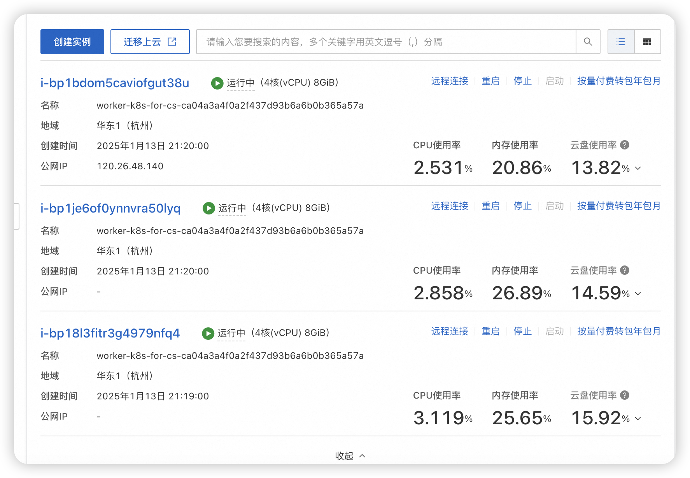
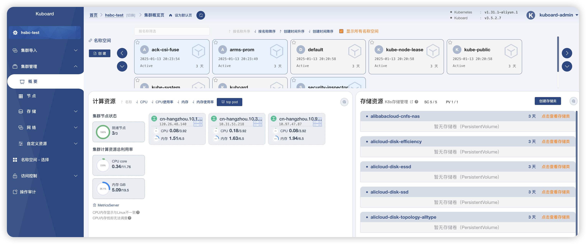
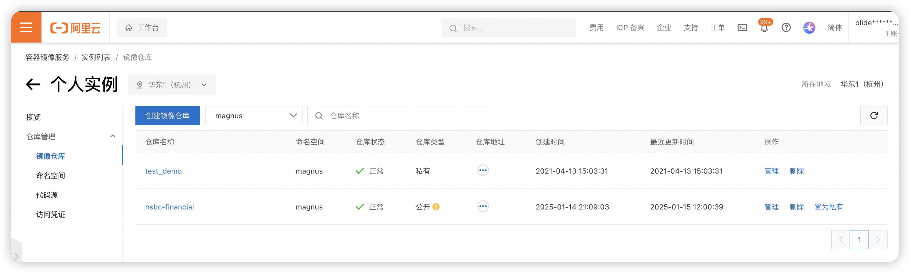

## 1. ACK集群
在阿里云上,申请了三台实例,用于运行ACK集群worker, 配置为4C8G, 其中一台实例机绑定了公网IP:120.26.48.140, 该公网IP作为集群服务的出口IP.


## 2. k8s集群管理
正常可以通过kubectl本地连接到ACK集群,进行集群管理. 不过为了可视化操作和运维方便起见, 我在本地安装可视化工具kuboard-v3, 用于连接到ACK集群, 进行集群管理.


## 3. 镜像仓库
在阿里云上创建私有镜像仓库, 用于存放我的应用实例镜像(镜像仓库名称:hsbc-financial).k8s集群部署通过拉取该镜像仓库镜像,实现在k8s上的应用部署.

应用docker镜像仓库是 : registry.cn-hangzhou.aliyuncs.com/magnus/hsbc-financial:v1.0.5


## 4. k8s部署配置
部署应用实例的时候,需要考虑一下几点,以便增加系统高可用.
1. 要配置反亲和性策略,确保多个实例不会全部部署在一台worker节点上.
2. 配置更新策略. 一般发版逻辑控制,需要配置滚动更新,这样可以保证系统在发版的时候还能正常提供可靠服务.
3. 配置HPA, 保证实例可以做到弹性扩缩容.
4. 配置service时, 这里为了简化操作, Service类型设置为NodePort,直接通过端口暴露到公网访问, 这样就可以通过公网IP+端口访问到应用实例.
- #### 服务可以公网访问的地址: http://120.26.48.140:30080
- 例如, 压测接口: curl -i http://120.26.48.140:30080/pressure/test/transaction
```yaml
#Deployment 配置
apiVersion: apps/v1
kind: Deployment
metadata:
  name: hsbc-financial-deployment
  labels:
    app: hsbc-financial
spec:
  replicas: 2  # 实例数为2
  selector:
    matchLabels:
      app: hsbc-financial
  strategy:
    type: RollingUpdate  # 配置更新策略为滚动更新
    rollingUpdate:
      maxUnavailable: 1  # 更新时最大不可用实例数
      maxSurge: 1        # 更新时最大新增实例数
  template:
    metadata:
      labels:
        app: hsbc-financial
    spec:
      affinity:
        podAntiAffinity:  # 配置反亲和性策略
          preferredDuringSchedulingIgnoredDuringExecution:
            - podAffinityTerm:
                labelSelector:
                  matchLabels:
                    app: hsbc-financial
                topologyKey: kubernetes.io/hostname
              weight: 100
      containers:
        - name: hsbc-financial-container
          image: registry.cn-hangzhou.aliyuncs.com/magnus/hsbc-financial:v1.0.5  # 指定镜像
          ports:
            - containerPort: 8080  # 容器暴露端口8080
          resources:
            limits:
              cpu: 500m
              ephemeral-storage: 4Gi
              memory: 1Gi
            requests:
              cpu: 500m
              ephemeral-storage: 2Gi
              memory: 512Mi

---
# Service 配置
apiVersion: v1
kind: Service
metadata:
  name: hsbc-financial-service
spec:
  type: NodePort  # Service类型为NodePort，暴露端口
  selector:
    app: hsbc-financial
  ports:
    - port: 8080          # Service的端口
      targetPort: 8080    # Pod中容器的端口
      nodePort: 30080     # 节点上暴露的端口（30000-32767间未被占用的端口）

---
# 自动扩缩容配置
apiVersion: autoscaling/v2beta2
kind: HorizontalPodAutoscaler
metadata:
  name: hsbc-financial-hpa
spec:
  scaleTargetRef:
    apiVersion: apps/v1
    kind: Deployment
    name: hsbc-financial-deployment  # 关联的Deployment名称
  minReplicas: 2    # 最小实例数
  maxReplicas: 10   # 最大实例数，根据需要调整
  metrics:
    - type: Resource
      resource:
        name: cpu
        target:
          type: Utilization
          averageUtilization: 80  # 当CPU利用率超过80%时触发扩容


```