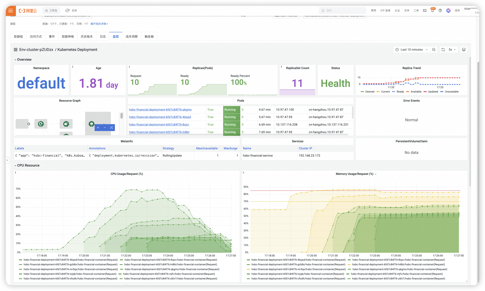
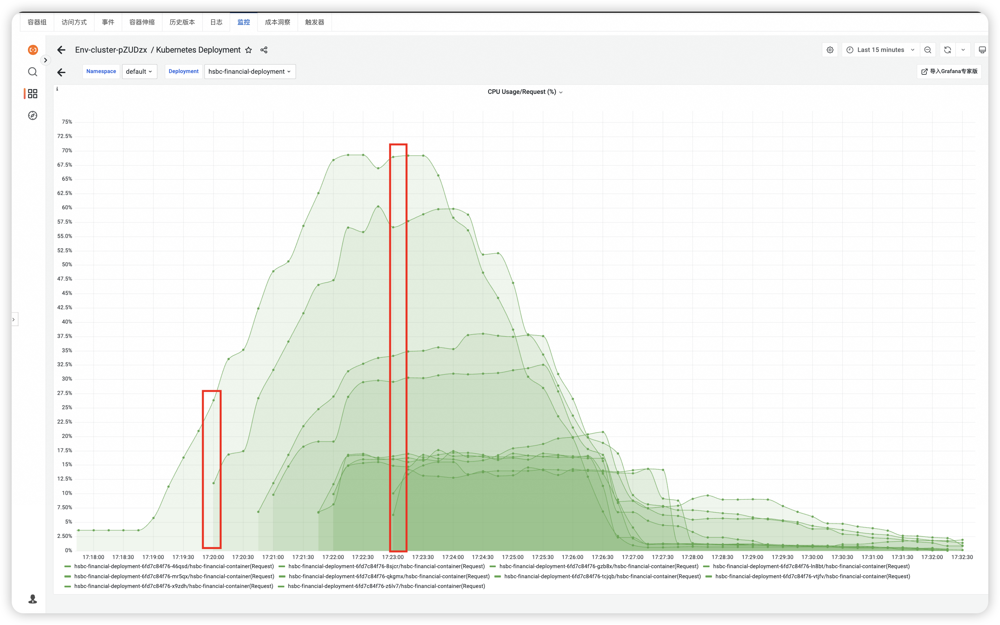
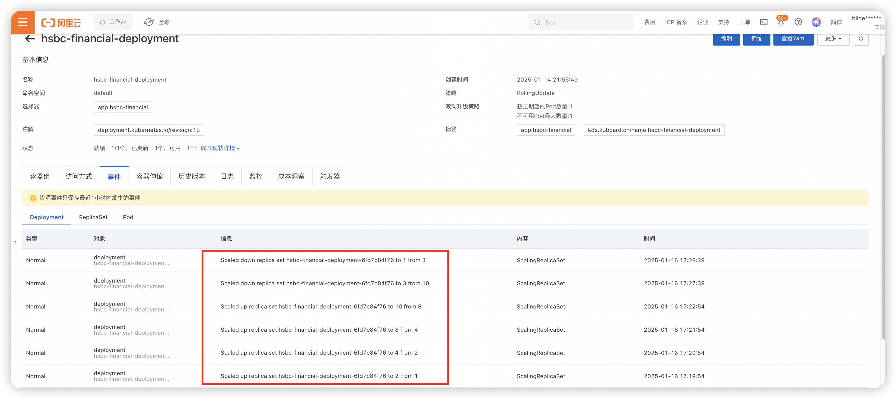

## 前言
本工程涉及的测试包括:
- #### 1. 开发阶段的单元测试和集成测试.
- #### 2. 压力性能测试.
- #### 3. k8s部署环节的弹性测试
## 1. 单元测试和集成测试.
在代码工程中,所有核心接口及核心业务逻辑都进行了单元测试和集成测试.
其中domain层中, 最核心的AccountService和TransactionService都进行了单元测试, 测试覆盖率达到了80%以上.
infrastructure层中, facade实现类, redisson实现类,MQ消息发送都进行了单元测试, 测试覆盖率达到了80%以上.
application层, TransactionController对外的服务接口,实现了集成测试.
### 单测代码覆盖率结果
代码覆盖率详情可以查看document/unit-test文件夹下的内容.
- **[查看 jacoco 代码覆盖率结果详情](./unit-test)**

## 2. 压力性能测试
本工程采用jmeter对核心服务进行压力测试.其中为了更方便的进行压力测试,进行了如下前期准备工作:
1. 引入的faker组件, 用于生成模拟测试数据.前期,通过faker生成50个用户账号信息,然后通过faker模拟随机交易信息.
- #### faker模拟数据生成器包路径为:com.hsbc.financial.application.pressure.DataGenerator
2. 封装了一个压力测试接口, /pressure/test/transaction,  该接口可以做到随机选择50个用户账号信息中的两个, 进行模拟交易.
- #### 测试接口对应的包路径为:com.hsbc.financial.application.controller.PressureTestController
### 压测场景说明
1. 实例资源为k8s中部署两个应用实例, 每个应用实例的资源限制为1C2G.
2. k8s集群公网IP申请的网络带宽为1Mbps.
3. 压测设置: 模拟1000个用户并发, 升压时间设为1s,模拟瞬间大流量的场景, 持续发送50轮次.
### 压测结果
压测结果详情可以查看document/jmeter文件夹下的内容.对于压测结果做以下几点说明:
1. 本次压测共产生50000条交易记录,其中失败了179, 失败原因全部是请求超时.
2. 结合cpu, 内存和network的监控看板得出结论:此次压测的瓶颈在网络带宽, 在请求流量高峰时刻, 部分请求因为网络带宽不足,导致连接超时.
- **[查看 JMeter 测试结果详情](./jmeter)**

## 3. 弹性测试
弹性测试,主要是测试k8s集群的应用服务pod的自动扩缩容能力,包括pod在遇到高流量情况下,cpu在满足一定阈值后, 自动扩容pod实例, 在流量下降后, 自动缩容pod实例.

k8s的自动扩缩容能力也包含了pod的自动重启能力, 当pod出现异常时, 会自动重启pod, 保证pod的可用性.所以我基于HPA配置,对系统进行弹性压力测试.

#### 压测场景说明
1. 因为购买的网络带宽为1Mbps, 不太能支持太大流量,为了能够保证HPA的弹性效果, 我的资源设置极端一些, 这个仅在测试环境使用, 生产环境不建议这样设置.
2. 初始状态: 设置一个应用实例, 资源限制为:cpu500m, 内存512Mi, 实例数为1.
3. HPA设置: 设置cpu的阈值为50%, 最小实例数为1, 最大实例数为10. 此处cpu设置50%,只是为了确保在当前网络带宽情况下,可以触发HPA.
4. 压测设置: 模拟1000个用户并发, 升压时间设为1s,模拟瞬间大流量的场景, 持续发送50轮次.

#### 测试结果
测试结果主要通过Prometheus监控图标可以看出. 具体监控图结果信息,可以查看document/HPA-test文件夹.
关键节点信息如下:
1. 压测开始时间是17:19:42. 在17.19:54触发扩容机制, k8s启动扩容扩容到2个pod实例.
2. 紧接着,随着CPU使用率不下降, 在之后的几个时间点:
   17:20:54,从2扩容到4个pod实例
   17:21:54, 从4扩容到8个实例
   17:22:54 从8扩容到10个实例
3. 然后流量过后, 17:27:39, 从10缩容到了3个实例.  17:28:39从3缩容到1个实例

HPA测试整体性能监控:

HPA测试全流程CPU性能监控:

HPA测试全流程容器扩缩容event列表:

- **[查看 HPA 弹性测试结果详情](./document/HPA-test)**